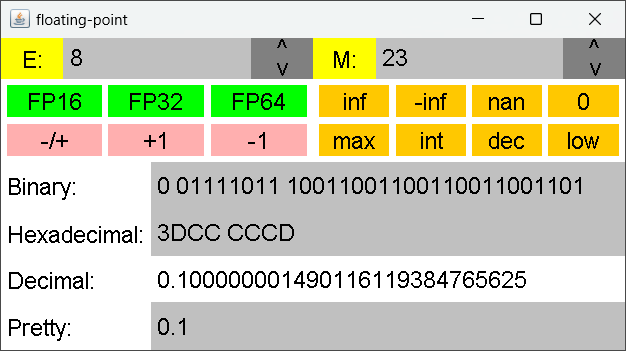

# floating-point
A simple applet for visualizing floating-point configurations (with customizable exponent and mantissa bit sizes) and converting between decimal, binary, and hexadecimal floating point representations.

## Technologies
* Kotlin 1.7+
* [Moulton Scalable Menus](https://github.com/mmoult/Moulton-Scalable-Menus) version 1.15

A pre-compiled jar file is also available for download.

## Use

### Value Entering
Enter the desired value in binary, hexadecimal, or decimal. After deselection (hit enter for quick submission after editing), the contents of all four fields will be updated to represent the same value.

Below is a brief description of each field:
- __Binary:__ The floating point value represented in binary. Each of the three sections (sign, exponent, mantissa) are automatically separated by spaces.
- __Hexadecimal:__ The floating point value represented in hexadecimal. A space is automatically inserted after every two bytes for increased readability.
- __Decimal:__ The exact value in decimal represented by the binary and hexadecimal fields. Floating point representation cannot always exactly represent the value entered in the Pretty field. In these cases, the decimal field shows the closest approximation used.
- __Pretty:__ An exact value in decimal. Unlike the decimal field, this will *not* be modified if the value cannot be exactly represented. It is very useful when comparing approximations between precision configurations or when comparing error from the true result.

### Precision Customization
A floating point number has three component parts: a sign bit, some exponent bit(s), and some mantissa bit(s). An exact number of bits to use for exponent and mantissa sections can be selected by entering that value in the corresponding text box at the top left and right, respectively, of the applet. For example, FP32 uses 32 bits in total: 1 sign bit, 8 exponent bits, and 23 mantissa bits. For convenience, the number of bits for exponent or mantissa sections can also be increased or decreased by one by clicking the corresponding up or down button.

When a precision section is edited, the binary, hexadecimal, and decimal value fields will update to match the approximate the value in the Pretty field with the new configuration.

### Shortcut Buttons
There are two types of shortcut buttons: precision shortcuts and value shortcuts.

The precision shortcuts are green buttons towards the top-left of the applet. Precision shortcuts set exponent and mantissa section sizes. For example, FP16 uses 5 exponent bits and 10 mantissa bits, FP32 (float) uses 8 exponent bits and 23 mantissa bits, and FP64 (double) uses 11 exponent bits and 52 mantissa bits.

The value shortcuts are orange buttons towards the top-right of the applet. Value shortcuts set the value of the Pretty field to the selected value. Positive and negative infinity, NaN (not a number), and 0 are useful values to inspect, so they have dedicated shortcuts.
